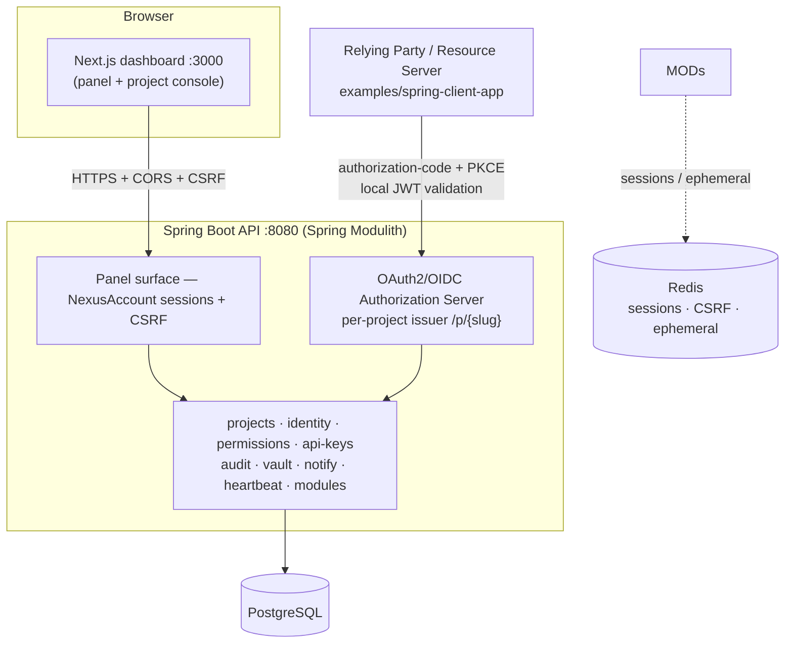

<div align="center">

<picture>
  <source media="(prefers-color-scheme: dark)" srcset="docs/assets/nexus-logo-dark.png"/>
  
</picture>

# Nexus

**A self-hosted control plane for multi-tenant apps: project-scoped OAuth2/OIDC, permissions, API keys, audit, and encrypted secrets.**

[](https://github.com/UnzorZ/Nexus/actions/workflows/ci.yml)
[](https://central.sonatype.com/artifact/dev.unzor.nexus.sdk/nexus-spring-boot-sdk)
[](LICENSE)


</div>

Nexus is a control plane for project-scoped apps. Each **project** is its own
tenant, with its own users, OAuth/OIDC realm, roles, API keys, and audit trail.
You run it on your own infrastructure, and your apps integrate over standard
OAuth2/OIDC.

> **Status:** active development, self-hostable today. The client SDK
> ([`nexus-spring-boot-sdk`](https://central.sonatype.com/artifact/dev.unzor.nexus.sdk/nexus-spring-boot-sdk))
> is on Maven Central. Production deployments still need real secrets/keystore
> setup and the usual operational hardening (see
> [Self-Hosting](#self-hosting-production)).

---

## Integrate your apps — the client SDK

Spring Boot apps integrate with Nexus through **`nexus-spring-boot-sdk`** (on
Maven Central). Add the dependency, set a few `nexus.*` properties, and you're
done — there's no dependency on the backend.

**Gradle**
```groovy
implementation 'dev.unzor.nexus.sdk:nexus-spring-boot-sdk:0.1.0'
```

**Maven**
```xml
<dependency>
  <groupId>dev.unzor.nexus.sdk</groupId>
  <artifactId>nexus-spring-boot-sdk</artifactId>
  <version>0.1.0</version>
</dependency>
```

See [`packages/nexus-spring-boot-sdk`](packages/nexus-spring-boot-sdk) for the SDK
README and [`examples/spring-client-app`](examples/spring-client-app) for a runnable
reference app. (SDK = Apache-2.0; the Nexus server remains AGPL-3.0.)

---

## Who is this for

- **Teams running several apps/services** that want shared, project-scoped
  identity, API keys, and permissions **without** adopting a hosted IdP.
- **Self-hosters** who want a control plane they fully own (data, keys, audit)
  under a strong copyleft license.
- **Builders** who want a reference for how to issue **per-tenant OAuth2/OIDC**
  and **embed fine-grained permissions in access tokens**.

## Why Nexus

- **Per-project OAuth/OIDC issuer** — every project is its own issuer at
  `{origin}/p/{slug}`, with its own JWKS, authorize/token/userinfo, consent, and
  RP-initiated logout (ADR-0016).
- **Permissions baked into the token** — the access token carries the user's
  effective permission keys (wildcards verbatim) so a resource server can
  authorize **locally from the JWT**, with `authz_version`-based revocation via
  introspection (ADR-0003).
- **Strong module isolation** — `projects`, `identity`, `permissions`, `api-keys`,
  `audit`, `vault`, `notify`, `heartbeat`, `modules`… each with its own boundary,
  communicating through `shared` events (not direct imports).
- **Fail-closed by default** — production secrets are required; dev keystores and
  dev vault keys are rejected outside dev/test profiles.

## Architecture



## What Nexus Provides

- **Control-plane accounts** — Nexus accounts, instance administration, panel
  login, CSRF, Redis-backed sessions, and session revocation.
- **Projects** — registry, memberships, ownership, and project status.
- **API keys** — project-identifying keys, hashed secrets, scopes, runtime
  authentication, and instance-token handshakes for high-frequency calls.
- **Permissions** — per-project permission catalog, roles, assignments, wildcard
  resolution, checks, and snapshots.
- **Identity** — project users, per-project OAuth/OIDC realms, OAuth clients,
  JWT/JWKS, MFA (TOTP), consent, logout, and persisted authorizations.
- **Modules** — per-project module enablement and request gating.
- **Audit** — central audit trail for sensitive actions.
- **Registry** — app registration and heartbeat/liveness tracking.
- **Notify** — templates, project/instance SMTP settings, and email delivery.
- **Vault** — encrypted project secrets with project-level master-key support.
- **Config & metrics** — project configuration values and append-only metrics.

## Repository Layout

```text
.
├── apps/
│   ├── api/   # Spring Boot backend (Gradle: :apps:nexus-api)
│   └── web/   # Next.js dashboard
├── docs/
│   ├── adr/              # architecture decision records
│   ├── auth/             # identity & account model
│   ├── deployment/       # backups, jwt-signing-keys, redis, production
│   ├── modules/          # per-module docs
│   └── nexus-technical-spec.md
├── examples/
│   └── spring-client-app/   # reference OIDC client + resource server (Boot 4)
├── compose.yaml            # dev: postgres + redis + next dev
├── compose.prod.yaml       # prod: builds API + dashboard images, fails fast on dev secrets
└── settings.gradle
```

## Requirements

- Java 21
- Docker + Docker Compose
- Node.js 22 (only if running the dashboard outside Docker)

## Quick Start

From the repository root:

```bash
# PostgreSQL + Redis + the Next.js dev container
docker compose up -d

# Spring Boot API
./gradlew :apps:nexus-api:bootRun
```

Open:

- Dashboard: http://localhost:3000
- API: http://localhost:8080
- Readiness: http://localhost:8080/actuator/health/readiness
- OpenAPI UI: http://localhost:8080/swagger-ui.html

**First run:** the first Nexus account you register becomes the initial instance
admin. From the dashboard, create a **project**, then explore its surfaces:
**Members · Roles · Permissions · API keys · OAuth clients · Audit**. To see the
OAuth/permissions flow end-to-end, follow the
[reference client + resource-server app](examples/spring-client-app/README.md).

### Local frontend instead of Docker

```bash
docker compose up -d postgres redis
cd apps/web && npm install && npm run dev   # :3000
# in another shell, from the repo root:
./gradlew :apps:nexus-api:bootRun
```

The host-run frontend reads `apps/web/.env.local`, not the repository-root `.env`.

## Self-Hosting (Production)

`compose.prod.yaml` builds production images for the API and the dashboard and
wires them to PostgreSQL and Redis. It **fails fast** until real secrets are
provided.

```bash
cp .env.example .env        # fill in REAL secrets + a JWT keystore path
docker compose -f compose.prod.yaml up -d --build
```

Required to boot (the API aborts otherwise — `IdentityStartupGuard`, `VaultCrypto`):

- a real JWT signing keystore (`NEXUS_OAUTH_JWK_KEYSTORE_LOCATION`, mounted into the container);
- a real OAuth bootstrap client secret and a real Vault master key;
- managed or locked-down PostgreSQL and Redis.

See the **[production runbook](docs/deployment/production.md)** for the full
checklist (secrets, monitoring, backups, upgrades) and
[JWT signing keys](docs/deployment/jwt-signing-keys.md),
[Redis](docs/deployment/redis.md),
[PostgreSQL backups](docs/deployment/backups.md).

## Configuration

Local defaults are intentionally convenient (dev only — rejected outside
dev/test profiles):

| Setting | Dev default |
|---|---|
| PostgreSQL | `nexus / nexus / nexus` |
| Redis | `redis://localhost:6379` |
| OAuth bootstrap client secret | `changeme-local-dev` |
| JWT signing keystore | `classpath:keystore/dev-jwk.p12` |
| Vault master key | `nexus-dev-vault-master-key-do-not-use-in-prod` |

Production should set at least:

```bash
NEXUS_DATASOURCE_URL=jdbc:postgresql://...
NEXUS_DATASOURCE_USERNAME=...
NEXUS_DATASOURCE_PASSWORD=...
NEXUS_REDIS_URL=redis://...
NEXUS_FRONTEND_BASE_URL=https://...
NEXUS_OAUTH_BOOTSTRAP_CLIENT_SECRET=...
NEXUS_OAUTH_JWK_KEYSTORE_LOCATION=file:/etc/nexus/jwt-keystore.p12
NEXUS_OAUTH_JWK_KEYSTORE_PASSWORD=... ; NEXUS_OAUTH_JWK_KEY_ALIAS=... ; NEXUS_OAUTH_JWK_KEY_PASSWORD=...
NEXUS_VAULT_MASTER_KEY=...
```

Infrastructure metrics are exposed at `GET /actuator/prometheus` (see the
[threat model](docs/threat-model.md) for hardening guidance).

## Remote Development

Remote browser testing over HTTPS tunnels needs different cookie/CORS settings.
Use the `remote-dev` Spring profile and expose backend + frontend over HTTPS:

```bash
SPRING_PROFILES_ACTIVE=remote-dev \
NEXUS_FRONTEND_BASE_URL=<frontend-https-url> \
NEXUS_ALLOWED_DEV_ORIGINS=<frontend-https-url> \
SPRING_DOCKER_COMPOSE_LIFECYCLE_MANAGEMENT=START_ONLY \
./gradlew :apps:nexus-api:bootRun
```

The full zrok runbook lives in [AGENTS.md](AGENTS.md) under *Remote development
over zrok*.

## Tests & Quality

```bash
./gradlew :apps:nexus-api:test          # backend (Testcontainers — needs Docker)
cd examples/spring-client-app && ./gradlew build   # reference app
cd apps/web && npm run lint && npm run build        # dashboard
```

## Security Notes

This repository includes development-only secrets and a dev keystore so the
project boots locally without extra setup. They are deliberately named as dev
defaults and rejected outside explicit development/test profiles.

Before running Nexus outside local development:

- generate a real JWT signing keystore;
- set a real OAuth bootstrap client secret;
- set a real Vault master key;
- use managed or locked-down PostgreSQL and Redis;
- configure HTTPS, secure cookies, and production CORS;
- review module exposure and API key scopes.

Vulnerability reporting: see [SECURITY.md](SECURITY.md).

## Going Deeper

- [Technical spec](docs/nexus-technical-spec.md) · [Threat model](docs/threat-model.md)
- [ADR-0001: Nexus is the source of truth](docs/adr/0001-nexus-source-of-truth.md) ·
  [ADR-0002: Modular monolith](docs/adr/0002-modular-monolith-with-spring-modulith.md)
- [Accounts vs. project users](docs/auth/accounts-and-project-users.md) ·
  [Identity module](docs/modules/identity.md) ·
  [Production deployment](docs/deployment/production.md)
- [Reference client + resource server](examples/spring-client-app/README.md)

## Contributing

Contributions are welcome under AGPL-3.0 — see [CONTRIBUTING.md](CONTRIBUTING.md)
(setup, module-boundary rules, the Spring Modulith gotchas) and the
[Code of Conduct](CODE_OF_CONDUCT.md).

## License

Nexus is licensed under the [GNU Affero General Public License v3.0](LICENSE).

AGPL-3.0 is a strong copyleft license: you may use, study, modify, and
redistribute the software, **including** when you make it available over a
network (e.g. as a hosted service). Modifications and derivative works that you
expose as a network service must be offered to their users under the same
AGPL-3.0 terms, including access to the corresponding source code. See `LICENSE`
for the full text and
[https://www.gnu.org/licenses/agpl-3.0.html](https://www.gnu.org/licenses/agpl-3.0.html).
